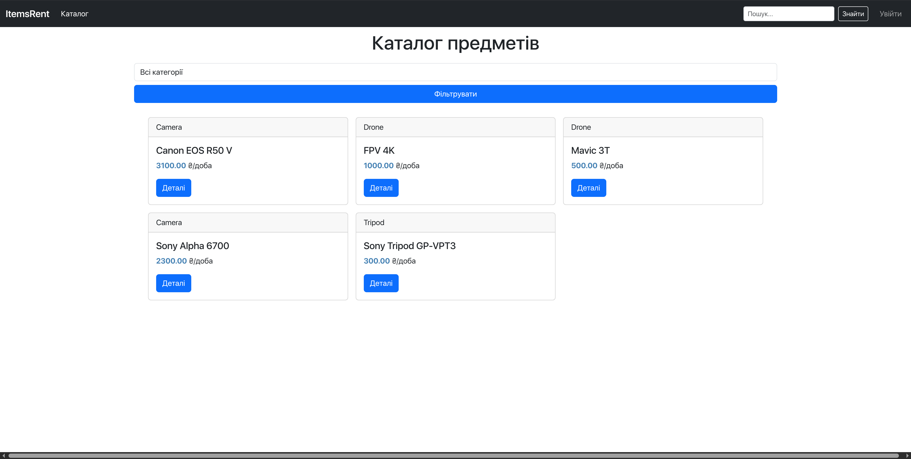

# Items Rent

**Items Rent** це вебдодаток для керування орендами різних речей. Користувачі можуть переглядати доступні пропозиції, фільтрувати за категоріями, та керувати своєю орендою

## Структура проєкту
main.py - Стартер для проєкту

/ItemsRent - Ядро проєкту
/ItemsRent/settings.py - Налаштування
/ItemsRent/urls.py - Головні маршрути

/main_app - Додаток проєкту
/main_app/templates/ - Шаблони html
/main_app/admin.py - Адмін-панель
/main_app/forms.py - Форми
/main_app/models.py - Моделі даних
/main_app/views.py - Логіка сторінок
/main_app/urls.py - Маршрути

LICENSE - ліцензія

## Як запустити
- Відкриваємо в редакторі `main.py` та налаштовуємо за необхідності
- Далі можна просто запустити цей файл `python main.py`

## Залежності
- Python 3.10+
- Django